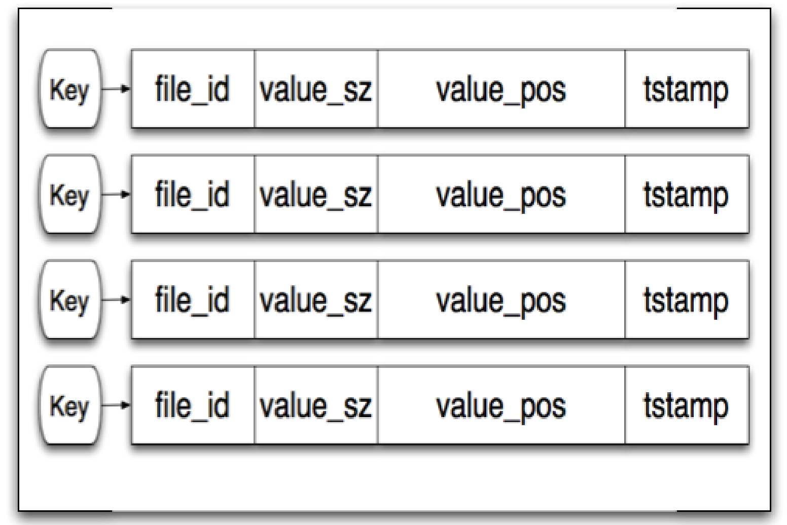
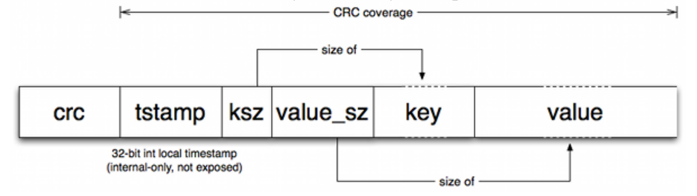

# 文档更新记录

| 修改人 |     日期      |     修改内容    |
|:---:|:-----------:|:-----------:|
| 马俊强 | 2022年11月26日 | 增加README.md |

# 项目简介
> 本项目是参考Bitcask设计开发的一个基于append-only-log和内存hash-table的键值对数据库引擎；引擎充分利用了磁盘顺序写入的性能较高这一机制，在内存中引入hash-table索引指向数据存储的文件和key在文件中的位置，实现了一个可以支持高效数据写入和检索的键值对存储引擎。

# 设计
## 文件设计
### 文件分类
>引擎中有如下几类文件：
- 段文件
> 段文件用于存储写入的数据；每个段文件大小到达引擎配置的最大值后，冻结当前段文件，创建新的段文件进行写入；当数据存储目录下的冻结段文件达到一定数量时，触发段文件合并压缩操作。
- hint文件
> 在引擎重启后，需要扫描数据目录下所有的段文件生成索引，以支持高效查询；在数据量比较大的情况下，扫描所有的段文件需要比较长的时间，为了加速引擎重启后的数据加载过程，在进行段合并时，为每个非活跃段文件生成hint文件，存储对应的段文件中的数据的索引概述，通过扫描hint文件可以快速加载数据；hint文件与段文件的对应关系通过其文件名称中的tmstamp识别。
- 内存索引(hash table)
> 为了支持高效查询，在内存中为每个key都存储了指向其value所在的文件名称及位置的信息，此为内存索引；

### 文件名称格式
> 所有文件名称格式都按照如下规则设计：

|前缀|分隔符|时间戳|
#### 段文件

| 文件  |  名称格式  | 前缀  | 分隔符 |        tmstamp        |
|:---:|:------:|:---:|:---:|:---------------------:|
| 段文件 | %3s_%d | seg |  _  | 纳秒时间戳(当前段文件创建时的系统时间戳) |
#### Hint文件

|   文件   |  名称格式  |   前缀    | 分隔符 |        tmstamp         |
|:------:|:------:|:-------:|:---:|:----------------------:|
| Hint文件 | %4s_%d |  hint   |  _  | 纳秒时间戳(与其关联的段文件时间戳保持一致) |

### 文件内容格式
#### 内存索引(hash table)
##### key
>有效数据项的key,已删除的key不会在hash table中存在记录
##### val
- fileName 当前key所在的段文件名称
- valsz    数据value的字节长度
- valops   数据value在文件中的位置(相对于文件开头的偏移量)
- tmstamp  当前索引的生成时间(数据最后一次写入的时间)

> hash table 的val 可以使用字符串形式，而不是对象，这样可以节省一些内存

#### 段文件
>%08x%016x%02x%03x%s%s
- crc     crc校验位，覆盖以下各项；存储格式为：8位16进制数
- tmstamp 当前记录生成的时间戳；存储格式为：16位16进制数
- keysz   数据key的字节长度；存储格式为：2位16进制数，key的最大长度为256字节
- valsz   数据value的字节长度；存储格式为：3位16进制数，value的最大长度为4K字节
- key     数据key
- value   数据value

#### hint文件
>%016x%02x%03x%016x%s
- tmstmap 当前记录对应的segment 记录的tmstamp;存储格式：16位16进制数
- keysz   当前记录对应的segment 记录的keysz
- valsz   当前记录对应的segment 记录的valsz
- valops  当前记录对应的segment 记录的value在segment文件中的位置(相对于文件开头的偏移量),存储格式：16位16进制数，段文件最大字节长度：2^64
- key     当前记录对应的segment 记录的key
## 机制设计
### 引擎启动
>引擎启动流程如下：
1. 根据系统参数设置数据存储目录，以备后续使用；
2. 扫描数据存储目录，获取目录下所有的段文件列表；
3. 将所有段文件，按照其tmstamp倒序排列(排序不是必须的)；
4. 遍历排序的后的段文件列表
   1. 若当前段文件存在hint文件，则逐行解析hint文件，根据解析内容更新索引
   2. 若当前段文件不存在hint文件，则从文件开头至末尾(顺序也可以是从文件末尾至开头)，逐行解析segment文件(需要检查CRC校验值)，根据解析内容更新索引
### 更新内存索引
>更新索引流程如下：
1. 从索引中获取当前key对应的索引项
2. 若不存在索引项
   1. 若当前写入内容的valsz字段的值大于0，新增索引项
   2. 否则，返回提示「key不存在」
3. 若存在索引项
   1. 若已存在的索引项的tmstmap大于当前项(参数)的tmstamp
      1. 若当前写入内容的valsz字段的值大于0，更新索引项
      2. 否则，删除索引项
   2. 否则，返回提示「更新索引项失败，当前数据为旧数据」
   
### 数据写入
#### 新增/更新数据
1. 根据key,value生成数据写入segment文件
2. 更新索引
#### 删除数据
1. 根据key生成数据(valsz项为0，此为数据删除记录——墓碑记录，在段合并压缩时使用)，写入segment文件
2. 更新索引
### 段合并压缩
>因为数据库引擎的数据是存放在append-only-log文件中，所以，对于无效数据，不能删除；为了避免无效数据占用磁盘空间，需要按照一定的规则触发段合并压缩流程；在段合并压缩过程中，删除无效数据，并未每个合并生成的段文件生成hint文件，加速引擎重启后加载数据的过程。

>综上，段合并的目的有两个：
- 删除无效数据，将多个段文件合并为新的段文件(完成之后需要更新索引)
- 为合并生成的段文件生成hint文件

#### 段合并的流程
1. 检查当前是否存在合并进程在运行，若存在则返回
2. 获取数据目录下所有冻结的段文件列表
3. 检查冻结的段文件数目，若小于触发合并流程的阈值，则返回
4. 将所有段文件，按照其tmstamp倒序排列(也可不排序)
5. 从冻结段文件列表头部开始遍历文件列表：
   1. 从段文件开头至段文件末尾，逐行读取文件内容，并解析:
      1. 从内存索引(hash table)中查询当前key对应的索引条目
         1. 若索引条目存在，且索引fileName和tmstamp与当前段文件fileName及当前记录的tmstamp一致
            1. 向合并生成的段文件中写入新的记录(计算valops)
            2. 向对应的hint文件中写入新的记录
            3. 更新索引
         2. 若索引条目不存在，continue
      3. 若当前段文件合并结束
         1. 删除原段文件及其对应的hint文件(若存在)
         2. 若合并生成的段文件大小达到上限，则创建新的段文件和对应的hint文件
         3. 继续重新开始上面的合并流程
### 数据查询
1. 查询内存索引
   1. 若不存在key,则记录不存在，返回null
   2. 若存在key,则从索引中获取当前key所在的段文件名称及value在段文件中的位置
2. 根据1.2获取到的文件名称和value在文件中的位置，读取value值，返回value
## 接口设计

| 接口签名                                   | 描述                       | 备注              |
|:---------------------------------------|:-------------------------|:----------------|
| func Put(key, value string) error      | 新增/更新key,value           | key,value必填     |
| func Query(key string) (string, error) | 查询key对应的value            | key必填           |
| func Remove(key string) error          | 删除key对应的记录               | key必填           |
| func StartEngine(dataDir string)       | 启动数据库引擎                  | dataDir选填       |
| func ListKey()[]string                 | 返回数据库当前所有有效key           ||
| func Sync()                            | 将写入数据库但尚未刷新到磁盘的数据全部保存到磁盘 ||
| func Close()                           | 关闭当前数据库                  ||

# 待学习的知识
- effective go https://makeoptim.com/golang/effective-go
- go mod
- go 项目结构
- go 日志
- go 异常
- go context
- go http并发
- go test
- go profile
- go gc
- go 内存模型
- go io
# TODO List
- 代码结构
  - 参考标准的代码结构重新整理项目代码结构
- 日志
  - 日志分级别、分文件、按日滚动打包备份
  - 日志格式统一、规范
- 异常处理
  - 异常集中在最外层处理，且在异常时，要提示客户端
- 读并发
  - 要实现读并发,context
- 测试
  - 单元测试
  - 基准测试
  - 性能分析
- 客户端开发
  - shell 脚本
  - API调用样例
  - http 服务器
